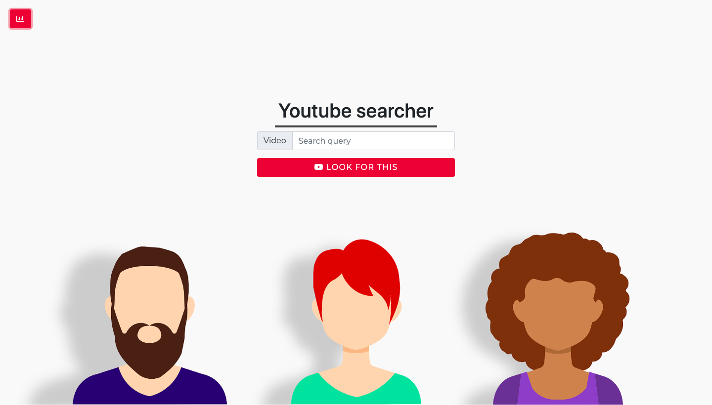

# Youtube API searcher

Custom youtube search engine for education purposes. This app connect to API throught API key from Google Console.
This app consists from search engine and charts.



## Getting Started

These instructions will get you a copy of the project up and running on your local machine for development and testing purposes. See deployment for notes on how to deploy the project on a live system.

### You should know

This projects work only in chrome for now becouse it uses modules. 
If you want use other  browsers you need to install *babel* and *webpack* to built javascript.

Use your own API key. The one is used doesn't work anymore.

### Prerequisites

You need to install [**npm**](https://www.npmjs.com/get-npm) before start here.

We used some third partys tools and frameworks for this project:

1.Chart.js
2.Bootstrap with JQuery. 
3.Font Awesome

They are linked directly to index.html by link, so you don't need download anything. You just have to run npm install from termin in your project directory after you cloned it.

### Installing

```
npm install
```

This download all depedencies. After that **you need to update your YoutubeApi Key in YoutubeApi.js file.**

## Built With

* [Bootstrap](https://getbootstrap.com) - The web CSS framework
* [Npm](https://www.npmjs.com) - Package manager
* [JQuery](https://jquery.com) - Javascript Libary
* [Chart.js](https://www.chartjs.org) - Javascript libary for charts
* [Font Awesome](https://fontawesome.com) - Font Icons Libary

## Authors

* **Adrián Mindek** - *Initial work* - [Surzo18](https://github.com/surzo18)

## License

Free for use and sharing.

